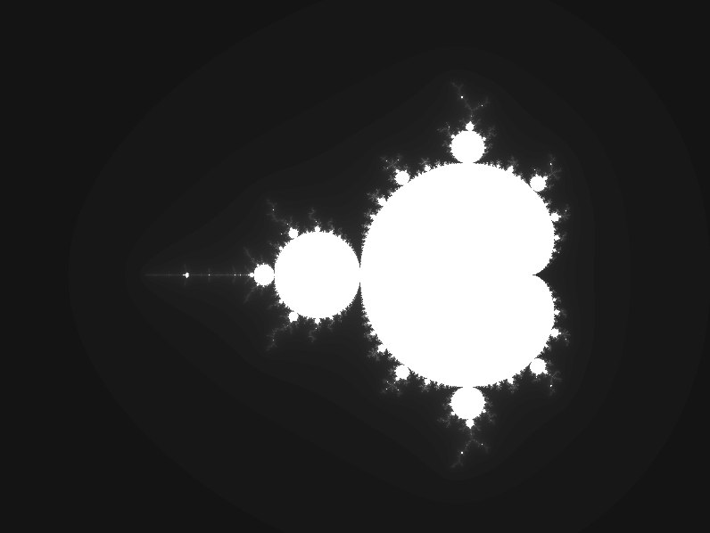

# SViewer

Позволяет просматривать фрагментарные шейдеры, написанные на
языке GLSL.

## Использование

```
./sviewer <path-to-shader> [options]
```

В качестве опций можно передать следующие аргументы:

### `--const-uniform` / `-c`

Позволяет передать в шейдер uniform переменную.
Синтаксис:
```
--const-uniform <type>:<name>=<value>
```
Поддерживаемые типы: `float`, `uint`, `vec2`
Примеры:
```
--const-uniform float:x=13.3
--const-uniform uint:n=5
--const-uniform "vec2:c0=0.35, 0.35"
```

### `--width`/`-ww` и `--height`/`-wh`

Настройки окна
Синтаксис:
```
--width <int>
--height <int>
```

### `--expr-uniform` / `-e`

Позволяет передать в шейдер uniform переменную, значение которой будет меняться в зависимости от времени.
Синтаксис:
```
--expr-uniform <type>:<name>=<function-of-t>
```
Поддерживаемые типы: `float`, `vec2`
Примеры:
```
--expr-uniform "float: x = 2t + 3"
--expr-uniform "vec2: c0 = 5t^2, 3t"
```

## Примеры использования (с шейдерами из папки shaders)

### Множество Мандельброта 

```
./sviewer shaders/mndl.frag
```




### Множество Жюлиа
```
./sviewer shaders/julia.frag -e "vec2:c= 0.35 + 0.01*sin(t),0.35 - 0.01*sin(t)"
```


### Красивые капельки
```
./sviewer shaders/noise.frag -c "float:x=1" -c "float:y=5"
```


## Запуск в Docker (с Xorg)

```
xhost +
docker build -t tmp1 .
docker run -e DISPLAY=$DISPLAY -v /tmp/.X11-unix:/tmp/.X11-unix -it --rm tmp1 /bin/bash 
```

## Сборка на Linux

Установить зависимости:
```
sudo apt update
sudo apt install \
    libxrandr-dev \
    libxcursor-dev \
    libudev-dev \
    libfreetype-dev \
    libopenal-dev \
    libflac-dev \
    libvorbis-dev \
    libgl1-mesa-dev \
    libegl1-mesa-dev
```

Либо используя dnf:
```
sudo dnf install openal-soft-devel \ 
                 libvorbis-devel \
                 flac-devel \
                 freetype-devel
```

Собрать командами

```
cmake -S . -B build -DCMAKE_BUILD_TYPE=Release
cmake --build build
```

## Сборка Windows

Собрать командами

```
cmake -S . -B build
cmake --build build --config Release
```
